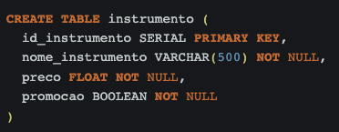
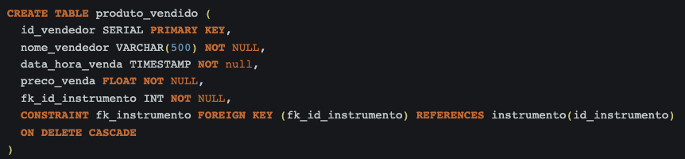
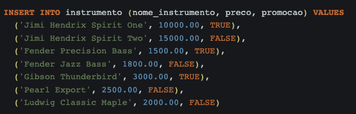
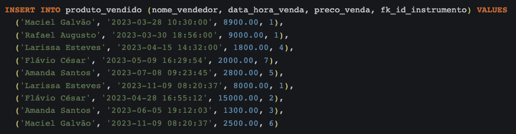
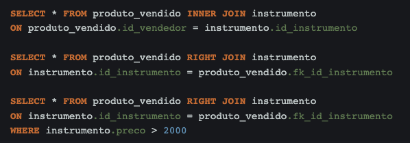

# Banco de Dados II - Desafio 1 Code Park 1

Desenvolva um banco de dados e relacione tabelas através de chaves estrangeiras ou nomes de colunas iguais. Siga as instruções:

1. crie uma base de dados; 
2. crie tabelas nessa base de dados;
3. em cada tabela, adicione atributos;
4. insira dados em cada tabela;
5. utilize os comandos Joins para realizar consultas nas tabelas.

Trabalhe esse código em seu IDE, suba ele para sua conta no GitHub e compartilhe o link desse projeto no campo ao lado para que outros desenvolvedores possam analisá-lo.

